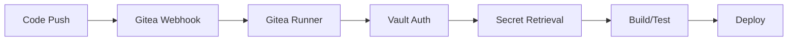

# K3s Homelab - DevOps Learning Environment

A comprehensive homelab setup running on k3s Kubernetes cluster, featuring Gitea, Vault, and GitLab Runner for learning DevOps practices and CI/CD pipelines.

## 🏗️ Architecture Overview

This homelab demonstrates enterprise-grade DevOps practices including:
- **Container Orchestration**: k3s lightweight Kubernetes distribution
- **Source Code Management**: Gitea self-hosted Git service
- **Secrets Management**: HashiCorp Vault with Kubernetes auth and secrets engine 
- **CI/CD Pipeline**: Gitea Runner with Vault integration
- **Infrastructure as Code**: Kubernetes manifests and configurations

homelab/
|--- Kubernetes/                       # Learning doc of k3s 
├── README.md                          # This file 
├── docs/                              # Documentation
│   ├── architecture.md                # System architecture
├── manifests/                         # Kubernetes manifests
│   ├── gitea/                         # Gitea deployment
│   ├── vault/                         # Vault configuration
│   ├── gitea-runner/                  # gitea Runner setup
├── nomad/                             # docs on nomad  
|── vault/                             # docs on vault 
|── Terrafrom/                         # docs on terrafrom 
|── Linux/                             # docs on linux 

## 🛠️ Components

### 1. k3s Kubernetes Cluster
- Lightweight Kubernetes distribution
- Built-in storage (SQLite)
- Embedded Traefik ingress controller
- Minimal resource footprint

### 2. Gitea - Self-Hosted Git Service
- Lightweight Git management solution
- Web UI and API access
- User management and permissions
- CI/CD integration via webhooks

### 3. HashiCorp Vault - Secrets Management
- Centralized secrets storage
- Kubernetes authentication method
- Dynamic secret generation
- Audit logging and monitoring

### 4. Gitea Runner - CI/CD Execution
- Kubernetes-based runner
- Vault integration for secure token access
- Docker-in-Docker support
- Custom job execution environments

## 🔄 CI/CD Pipeline Flow

## 📊 Key Features

### 🔒 Security
- **Vault Integration**: Secure secrets management with Kubernetes auth
- **RBAC**: Proper role-based access control
- **Network Policies**: Restricted inter-service communication
- **TLS**: Encrypted communication between services

### 🚀 CI/CD Capabilities
- **Multi-language Support**: Node.js, Python, Go, Java
- **Container Builds**: Docker-in-Docker support
- **Security Scanning**: Automated vulnerability assessment
- **Kubernetes Deployment**: Direct deployment to cluster

### 📈 Monitoring
- **Health Checks**: Comprehensive service monitoring
- **Logging**: Structured logging with aggregation
- **Metrics**: Performance monitoring and alerting
- **Debugging**: Built-in troubleshooting tools

## 🎯 Learning

This homelab provides hands-on experience with:

- **Kubernetes Operations**: Pod management, services, ingress
- **DevOps Practices**: CI/CD pipelines, automated testing
- **Security**: Secrets management, access control
- **Monitoring**: Log aggregation, health checks
- **Infrastructure as Code**: Declarative configuration

## 📚 Documentation

- [System Architecture](docs/architecture.md) - Complete architectural overview
- [Gitea Setup](docs/gitea-setup.md) - Gitea configuration and workflows
- [Vault Integration](docs/vault-integration.md) - Vault setup and policies
- [CI/CD Pipelines](docs/ci-cd-pipelines.md) - Pipeline examples and best practices

**Note**: This homelab is designed for educational purposes and learning DevOps practices. This is a sample of my learning environment .