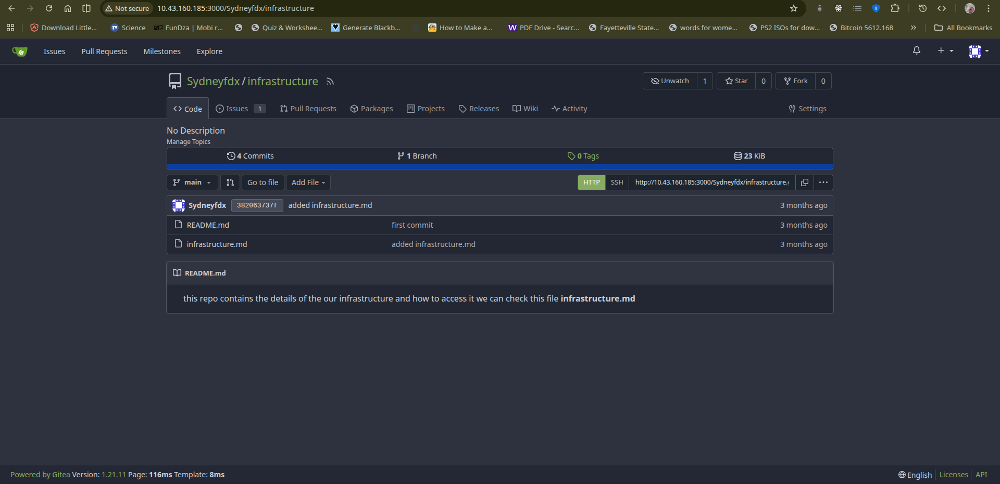
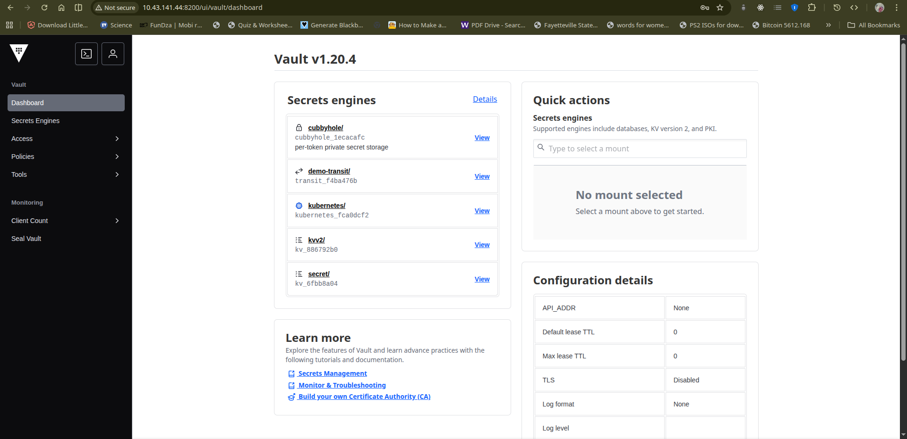
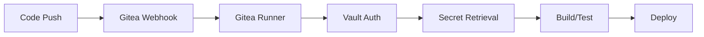
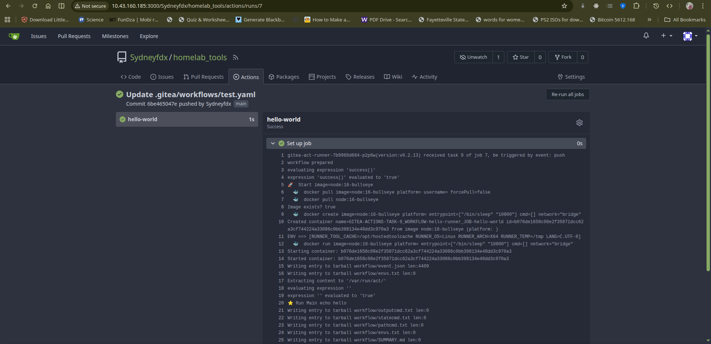

# K3s Homelab - DevOps Learning Environment

A comprehensive homelab setup running on k3s Kubernetes cluster, featuring Gitea, Vault, and GitLab Runner for learning DevOps practices and CI/CD pipelines.

## 🏗️ Architecture Overview

This homelab demonstrates enterprise-grade DevOps practices including:
- **Container Orchestration**: k3s lightweight Kubernetes distribution
- **Source Code Management**: Gitea self-hosted Git service
- **Secrets Management**: HashiCorp Vault with Kubernetes auth and secrets engine 
- **CI/CD Pipeline**: Gitea Runner with Vault integration
- **Infrastructure as Code**: Kubernetes manifests and configurations

```
homelab/
├── Kubernetes/            # Learning docs and k3s implementation
├── Linux/                 # Documentation on Linux administration
├── Terraform/             # IaC scripts and documentation
├── nomad/                 # Docs and configuration for Nomad orchestration
├── vault/                 # Security docs and Vault secret management
├── manifests/             # Kubernetes YAML manifests
│   ├── gitea/             # Gitea (Git Service) deployment
│   ├── gitea-runner/      # CI/CD Runner setup
│   └── vault/             # Vault-on-K8s configuration
├── docs/                  # General documentation
│   └── architecture.md    # System architecture diagrams/notes
└── README.md              # Project overview and status
```
## 🛠️ Components

### 1. k3s Kubernetes Cluster
- Lightweight Kubernetes distribution
- Built-in storage (SQLite)
- Embedded Traefik ingress controller
- Minimal resource footprint

### 2. Gitea - Self-Hosted Git Service
- Lightweight Git management solution
- Web UI and API access
- User management and permissions
- CI/CD integration via webhooks


### 3. HashiCorp Vault - Secrets Management
- Centralized secrets storage
- Kubernetes authentication method
- Dynamic secret generation
- Audit logging and monitoring



### 4. Gitea Runner - CI/CD Execution
- Kubernetes-based runner
- Vault integration for secure token access
- Docker-in-Docker support
- Custom job execution environments

## 🔄 CI/CD Pipeline Flow


```mermaid
graph LR
    A[Code Push] --> B[Gitea Webhook]
    B --> C[Gitea Runner]
    C --> D[Vault Auth]
    D --> E[Secret Retrieval]
    E --> F[Build/Test]
    F --> G[Deploy]
```


## 📊 Key Features

### 🔒 Security
- **Vault Integration**: Secure secrets management with Kubernetes auth
- **RBAC**: Proper role-based access control
- **Network Policies**: Restricted inter-service communication
- **TLS**: Encrypted communication between services

### 🚀 CI/CD Capabilities
- **Multi-language Support**: Node.js, Python, Go, Java
- **Container Builds**: Docker-in-Docker support
- **Security Scanning**: Automated vulnerability assessment
- **Kubernetes Deployment**: Direct deployment to cluster

### 📈 Monitoring
- **Health Checks**: Comprehensive service monitoring
- **Logging**: Structured logging with aggregation
- **Metrics**: Performance monitoring and alerting
- **Debugging**: Built-in troubleshooting tools

## 🎯 Learning

This homelab provides hands-on experience with:

- **Kubernetes Operations**: Pod management, services, ingress
- **DevOps Practices**: CI/CD pipelines, automated testing
- **Security**: Secrets management, access control
- **Monitoring**: Log aggregation, health checks
- **Infrastructure as Code**: Declarative configuration


## 📚 Documentation

- [System Architecture](docs/architecture.md) - Complete architectural overview


**Note**: This homelab is designed for educational purposes and learning DevOps practices. This is a sample of my learning environment .